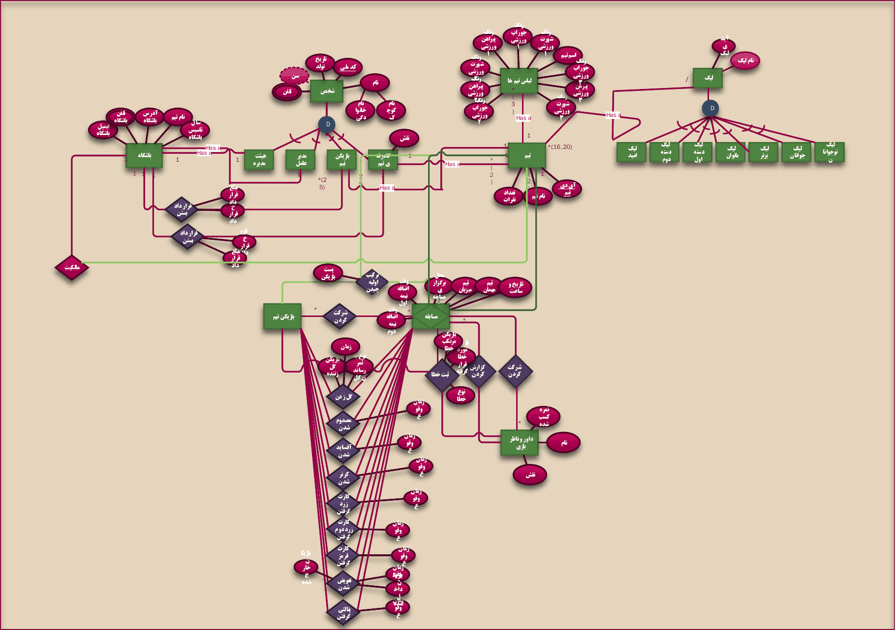

# Football league database (SQL Server)

My project for the Database Design course of my bachelor's at Islamic Azad University, South Tehran Branch (2021). The task was to design a database for all Iranian club football competitions, build it in Microsoft SQL Server, fill it with test data and answer the course questions with queries. I drew the ER model in Visio and built 21 tables with their keys and constraints in SQL Server.

## ER diagram



The diagram is in Persian. The Visio file is `erd.vsdx`, and `erd.pdf` has the same diagram.

## The database

Table and column names are Persian words in Latin letters.

| Area | Tables |
|---|---|
| Leagues and standings | `league`, `team`, `league_team` (one row per team, league and season with games, wins, goals and points) |
| Clubs and people | `bashgah` (clubs), `modiramel` (CEOs), `bazikon` (players), `kadrefani` (coaching staff), `bazikon_team`, `kadrefani_team`, `qarardad_bazikon` and `qarardad_kadrefani` (contracts) |
| Matches | `game`, `lebas` (kits), `tarkibavaliye` (line-ups), `rooydad` and `game_bazikon` (events such as cards, corners and substitutions), `golZadan` (goals), `penaltiGereftan` (penalties), `sabteKhata` (fouls) |
| Referees | `davar`, `gozareshKardan` (referee reports) |

A few words that come up a lot: dore = season, emtiaz = points or rating, bazikon = player, davar = referee, tamashagar = spectators.

Besides 21 primary keys and 32 foreign keys, the database has these rules: players' and staff ages must be between 9 and 99, a team's player count (`teamCount`) is at most 25 and defaults to 25, team and club names are unique, and added time defaults to 0.

## Files

| File | What it is |
|---|---|
| `sql/01_schema.sql` | Creates the 21 tables with all keys and constraints |
| `sql/02_data.sql` | Inserts the 251 rows |
| `sql/03_queries.sql` | SQL queries for the course questions (12 queries) |
| `sql/scratch/` | Scripts from building the database in SSMS: creating tables, adding constraints and a first query |
| `tools/check_sqlite.py` | Builds the database in SQLite and runs the queries |
| `erd.vsdx`, `erd.pdf`, `images/erd.png` | ER diagram |
| `databaseProject.mdf`, `databaseProject_log.ldf`, `databaseProject.zip` | The SQL Server database files |
| `database export.xlsx`, `database export.pdf` | Every table's rows |
| `relational-algebra-answers.pdf` | My handwritten answers to the same questions in relational algebra |

## Queries

`sql/03_queries.sql` answers questions 1 to 7, 9 and 11 to 14 of the assignment with CTEs, joins and window functions (`RANK() OVER`):

| Question | Query |
|---|---|
| 1 | Champion of each season of the Premier League and the Women's League |
| 2 | Top scorer of each season of each league |
| 3, 4 | Team and player with the most fouls in each league and season |
| 5 | Players fouled most and least often in each league |
| 6 | Match with the most and the fewest spectators per league and season |
| 7 | Players sent off (second yellow or red card) |
| 9 | League table: played, won, drawn, lost, goals, goal difference, points |
| 11 | Goals scored and conceded per team and season, by type of goal |
| 12 | Matches each team played in each kit |
| 13 | Busiest main referee per league and season |
| 14 | Team with the most substitutions per league and season |

Example, question 7:

```
tarikh      gameId  bazikonFName  bazikonLName  rooydadName
1389-08-09  173     damoon        damooni       kartQermez
1389-09-08  183     dara          darayi        kartZard2
1391-01-01  103     sam           salamat       kartQermez
1391-01-10  113     mehrab        mehrabi       kartZard2
1396-06-06  53      ali           karimi        kartQermez
1396-06-16  153     sasan         sasani        kartZard2
1397-07-07  63      ali           dayi          kartZard2
```

## Running it

In SQL Server, create an empty database and run the three files in order, in SSMS or with sqlcmd:

```
sqlcmd -S localhost -C -Q "CREATE DATABASE footballLeague"
sqlcmd -S localhost -C -d footballLeague -f 65001 -i sql/01_schema.sql -i sql/02_data.sql -i sql/03_queries.sql
```

You can also attach `databaseProject.mdf` in SSMS (Databases > Attach). It is an earlier save, so it doesn't have the columns `game.lebasTeamMizban`, `game.lebasTeamMehman` and `davar.naghsh`.

Without SQL Server:

```
python tools/check_sqlite.py
```

This loads the same scripts into SQLite with foreign keys switched on, checks the row count and every foreign key, and prints the result of each query. The queries only use SQL that SQL Server and SQLite share.

## Notes on the data and the design

- The rows are test data. Team names are real, but the people, matches and numbers are made up, so some figures don't add up (one team has 3 wins from 2 games).
- Five tables are empty: fouls, penalties, line-ups and the two contract tables. Questions 3 to 5 need fouls, so they return no rows, and question 14 finds no substitutions for the teams that have a league row.
- `game` has no league or season column, so the queries place a match in a league through the home team's row in `league_team`. Adding `leagueId` and `dore` to `game` would make this direct.
- `davar` has one row per referee and match. A referee table plus a separate assignment table would avoid repeating names.
- Dates are Solar Hijri dates stored in DATE columns (for example 1394-03-03). They sort correctly, but date arithmetic on them gives wrong results.

## Tech

SQL Server (T-SQL) · SSMS · Microsoft Visio · SQLite · Python
